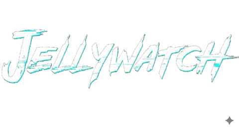
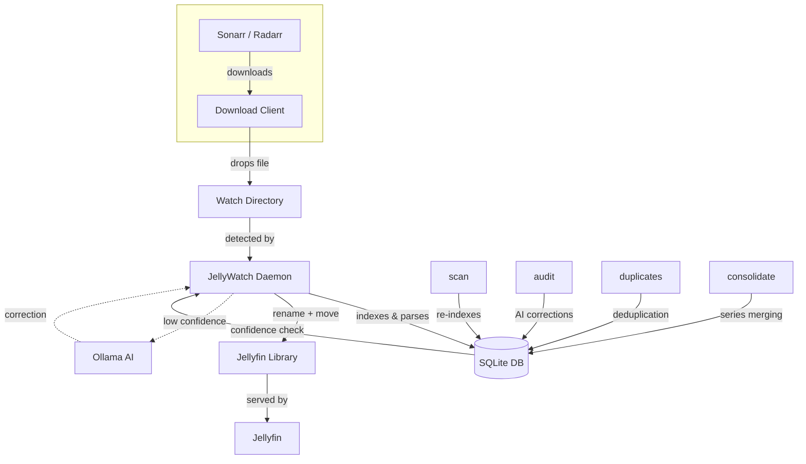

<div align="center">
  
</div>

---

> ⚠️ **WORK IN PROGRESS — NOT STABLE**
>
> This project is under active development. Features may change, break, or disappear without notice. Not recommended for production use. Use at your own risk.

---

Because Sonarr and Radarr can't be trusted with naming conventions.

## What It Does

Watches your download directories. Renames files to Jellyfin's naming standards. Moves them to the right place. Optionally asks a local AI (via Ollama) when it's not sure what something is.

```bash
curl -sSL https://raw.githubusercontent.com/Nomadcxx/jellywatch/main/install.sh | sudo bash
```

## The Problem

Your *arr stack downloads `Show.Name.S01E01.1080p.WEB-DL.x264-RARBG.mkv`. Jellyfin wants `TV Shows/Show Name (2019)/Season 01/Show Name (2019) S01E01.mkv`. This fixes that — automatically, with AI fallback when the filename is ambiguous.

## How It Works



See [docs/architecture.md](docs/architecture.md) for detailed flow.

## Commands

```bash
# Index your library into the database
jellywatch scan

# Watch a directory for new incoming files
jellywatch watch /downloads

# Organize a single file manually
jellywatch organize /downloads/Movie.Name.2024.mkv

# Sync Sonarr/Radarr path data with the database
jellywatch migrate
```

### AI Audit

Finds files with low parse confidence and proposes AI-assisted renames via Ollama:

```bash
jellywatch audit generate        # Identify low-confidence files
jellywatch audit dry-run         # Preview AI rename suggestions
jellywatch audit execute         # Apply fixes
```

The AI receives library type (Movies vs TV), folder path, and current parse as context.
See [docs/ai-context.md](docs/ai-context.md) for details.

### Duplicates & Consolidation

```bash
jellywatch duplicates generate   # Find duplicate media files
jellywatch duplicates execute    # Keep the best copy, remove the rest

jellywatch consolidate generate  # Find TV series split across multiple locations
jellywatch consolidate execute   # Merge them into a single library path
```

## Naming Rules

**Movies:** `Movies/Movie Name (YYYY)/Movie Name (YYYY).ext`

**TV Shows:** `TV Shows/Show Name (Year)/Season 01/Show Name (Year) S01E01.ext`

Release group noise is stripped automatically: `1080p`, `x264`, `WEB-DL`, `RARBG`, `-YTS`, and similar tags.

## Configuration

Lives at `~/.config/jellywatch/config.toml`

```toml
[watch]
movies = ["/downloads/movies"]
tv    = ["/downloads/tv"]

[libraries]
movies = ["/media/Movies"]
tv     = ["/media/TV Shows"]

[ai]
enabled              = true
ollama_endpoint      = "http://localhost:11434"
model                = "llama3.1"
confidence_threshold = 0.8

[options]
delete_source = true   # Remove source file after successful move
```

### Sonarr / Radarr

```toml
[sonarr]
enabled = true
url     = "http://localhost:8989"
api_key = "your-sonarr-api-key"

[radarr]
enabled = true
url     = "http://localhost:7878"
api_key = "your-radarr-api-key"
```

### File Permissions

If Jellyfin runs as a different user, set ownership on moved files:

```toml
[permissions]
user      = "jellyfin"
group     = "jellyfin"
file_mode = "0644"
dir_mode  = "0755"
```

> **Note:** The `jellywatchd` daemon must run as root to set file ownership.
> The systemd service is configured with minimal capabilities (`CAP_CHOWN`, `CAP_FOWNER`, `CAP_DAC_OVERRIDE`).

## Daemon

The installer sets up a systemd service. Manage it with:

```bash
systemctl status jellywatchd
journalctl -u jellywatchd -f
```

## Install

**One-liner:**

```bash
curl -sSL https://raw.githubusercontent.com/Nomadcxx/jellywatch/main/install.sh | sudo bash
```

**Manual:**

```bash
git clone https://github.com/Nomadcxx/jellywatch.git
cd jellywatch
go build -o installer ./cmd/installer
sudo ./installer
```

Requires Go 1.21+.

## License

GPL-3.0 or later
