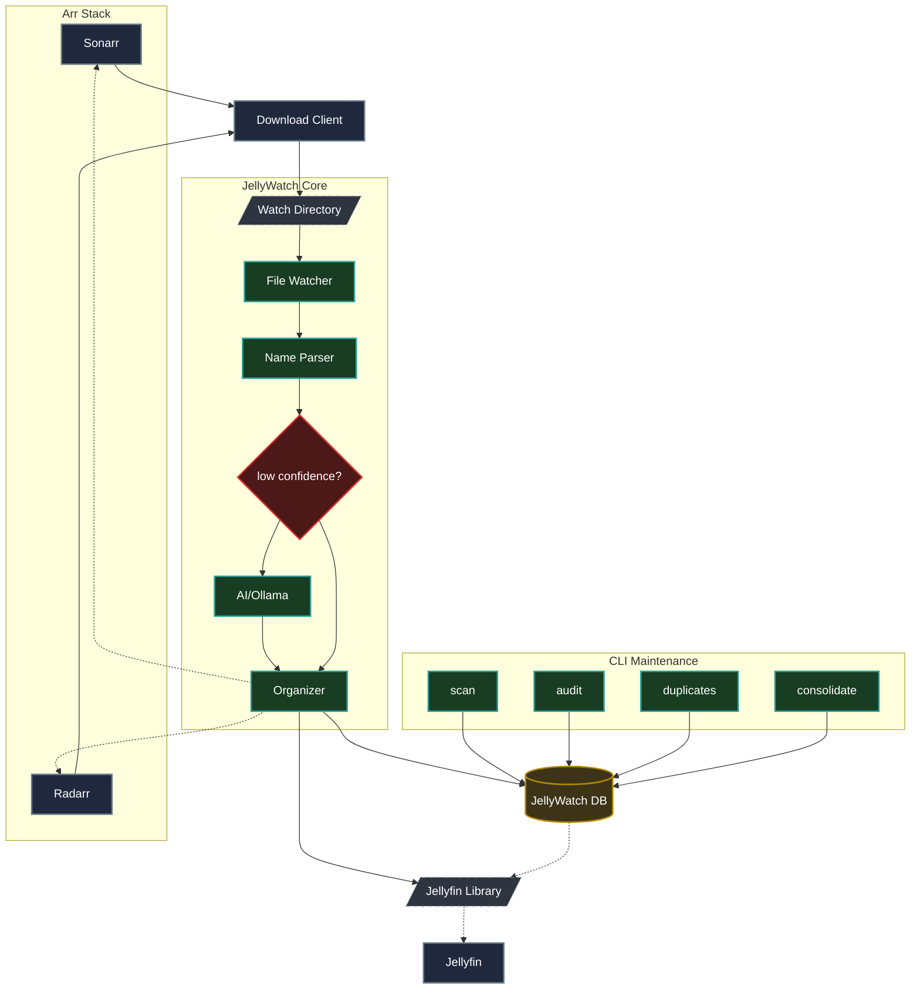

<div align="center">
  
  <p><em>Because Sonarr and Radarr can't be trusted with naming conventions</em></p>
</div>

---

## What It Does

Watches your download directories. Renames files to Jellyfin's standards. Moves them to the right place. Optionally asks a local AI when it's not sure what something is.

```bash
curl -sSL https://raw.githubusercontent.com/Nomadcxx/jellywatch/main/install.sh | sudo bash
```

## The Problem

Your *arr stack downloads `Movie.Name.2024.1080p.WEB-DL.x264-RARBG.mkv`. Jellyfin wants `Movie Name (2024)/Movie Name (2024).mkv`. This fixes that.

## How It Works

1. **Scan** your library to build a database of what you have
2. **Watch** download directories for new files
3. **Organize** files according to Jellyfin naming rules
4. **Audit** questionable parses with AI assistance
5. **Deduplicate** when you've hoarded the same movie five times
6. **Consolidate** when a series is scattered across six drives



*Full diagram: [docs/architecture.md](docs/architecture.md)*

## Quick Commands

```bash
jellywatch scan                    # Index your library
jellywatch watch /downloads        # Watch for new files
jellywatch organize /library       # Fix existing files

jellywatch audit generate          # Find low-confidence parses
jellywatch audit dry-run           # Preview AI suggestions
jellywatch audit execute           # Apply fixes

jellywatch duplicates generate     # Find duplicates
jellywatch duplicates execute      # Keep the best, delete the rest

jellywatch consolidate generate    # Find scattered series
jellywatch consolidate execute     # Bring them home
```

## Naming Rules

**Movies:** `Movies/Movie Name (YYYY)/Movie Name (YYYY).ext`

**TV Shows:** `TV Shows/Show Name (Year)/Season 01/Show Name (Year) S01E01.ext`

All the release group junk gets stripped: `1080p`, `x264`, `WEB-DL`, `RARBG`, `-YTS`, the works.

## Configuration

Lives at `~/.config/jellywatch/config.toml`

```toml
[watch]
movies = ["/downloads/movies"]
tv = ["/downloads/tv"]

[libraries]
movies = ["/media/Movies"]
tv = ["/media/TV Shows"]

[ai]
enabled = true
ollama_endpoint = "http://localhost:11434"
model = "llama3.1"
confidence_threshold = 0.8

[options]
delete_source = true    # Remove originals after moving
```

### Integrations

Works with Sonarr and Radarr for metadata. Point to their APIs:

```toml
[sonarr]
enabled = true
url = "http://localhost:8989"
api_key = "your-key"

[radarr]
enabled = true
url = "http://localhost:7878"
api_key = "your-key"
```

### Permissions

If Jellyfin runs as a different user:

```toml
[permissions]
user = "jellyfin"
group = "jellyfin"
file_mode = "0644"
dir_mode = "0755"
```

## Daemon

Runs as a systemd service. The installer sets this up.

```bash
systemctl status jellywatchd
journalctl -u jellywatchd -f
```

## Manual Install

```bash
git clone https://github.com/Nomadcxx/jellywatch.git
cd jellywatch
go build -o installer ./cmd/installer
sudo ./installer
```

Requires Go 1.21+.

## License

MIT
