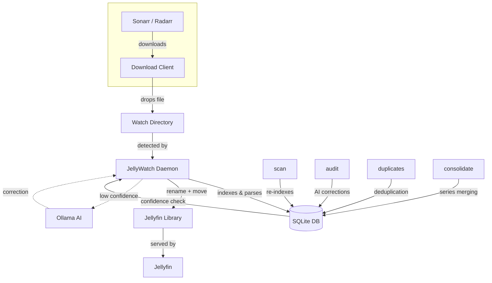

# Repo Cleanup, PR Review & README Update — Implementation Plan

> **For Claude:** REQUIRED SUB-SKILL: Use superpowers:executing-plans to implement this plan task-by-task.

**Goal:** Remove internal dev docs from git tracking, run a full code review on PR #3, and rewrite README.md with the new brand image (minimal/core feature set only).

**Architecture:** Three independent phases executed sequentially. Phase 1 is pure git/file ops. Phase 2 is a code review subagent dispatch. Phase 3 is a file copy + README rewrite.

**Tech Stack:** Git, Go 1.24, GitHub CLI (`gh`), Bash.

---

## Context

**Repo:** `/home/nomadx/Documents/jellywatch` (github.com/Nomadcxx/jellywatch)

**Brand image (source):** `/home/nomadx/Downloads/jellywatch_brand.png`

**PR to review:** https://github.com/Nomadcxx/jellywatch/pull/3
- Phase 2 Jellyfin webhook integration — 25 files, +2596/-86 lines
- Key new packages: `internal/jellyfin/`, `internal/notify/`, `internal/organizer/` (playback safety)
- DB schema v12 adds `jellyfin_items` table

**Real CLI commands that exist** (used in README):
- `jellywatch scan` — index library into DB
- `jellywatch watch <directory>` — watch for incoming files
- `jellywatch organize <source>` — rename/move a single file
- `jellywatch audit generate` — find low-confidence parses
- `jellywatch audit dry-run` — preview AI rename suggestions
- `jellywatch audit execute` — apply AI rename fixes
- `jellywatch duplicates generate` — detect duplicates
- `jellywatch duplicates execute` — keep best copy, delete rest
- `jellywatch consolidate generate` — find scattered TV series
- `jellywatch consolidate execute` — merge scattered series into one location
- `jellywatch migrate` — sync Sonarr/Radarr paths with DB

**DO NOT mention in README:** web dashboard, `serve` command, Jellyfin webhooks, phase 2/3 features.

---

## Phase 1 — Repo Cleanup

### Task 1: Remove tracked root-level dev docs from git and disk

**Files to git rm (untrack + delete from disk):**
- `AGENTS.md`
- `IMPLEMENTATION_PORT.md`
- `INSTALLER_PLAN.md`
- `PROBLEM_STATEMENT.md`
- `TODO.md`
- `errors.txt`

**Step 1: Confirm files are tracked**

```bash
git ls-files AGENTS.md IMPLEMENTATION_PORT.md INSTALLER_PLAN.md PROBLEM_STATEMENT.md TODO.md errors.txt
```

Expected: all 6 filenames printed (they are tracked).

**Step 2: Remove from git tracking and delete from disk**

```bash
git rm AGENTS.md IMPLEMENTATION_PORT.md INSTALLER_PLAN.md PROBLEM_STATEMENT.md TODO.md errors.txt
```

Expected: 6 lines like `rm 'AGENTS.md'`

**Step 3: Verify files are gone**

```bash
ls AGENTS.md 2>&1
```

Expected: `ls: cannot access 'AGENTS.md': No such file or directory`

---

### Task 2: Untrack docs/plans/ and docs/IMPLEMENTATION-SUMMARY.md (keep on disk)

These are already in `.gitignore` but were committed before the ignore rules were added.

**Step 1: Confirm count of tracked plans files**

```bash
git ls-files docs/plans/ | wc -l
git ls-files docs/IMPLEMENTATION-SUMMARY.md
```

Expected: `59` for plans, `docs/IMPLEMENTATION-SUMMARY.md` printed.

**Step 2: Untrack docs/plans/ recursively (keep on disk)**

```bash
git rm --cached -r docs/plans/
```

Expected: many lines like `rm 'docs/plans/2026-01-12-installer-condor-design.md'`

**Step 3: Untrack docs/IMPLEMENTATION-SUMMARY.md (keep on disk)**

```bash
git rm --cached docs/IMPLEMENTATION-SUMMARY.md
```

Expected: `rm 'docs/IMPLEMENTATION-SUMMARY.md'`

**Step 4: Verify files still exist on disk**

```bash
ls docs/plans/ | head -5
ls docs/IMPLEMENTATION-SUMMARY.md
```

Expected: files listed (not deleted).

**Step 5: Verify git no longer tracks them**

```bash
git ls-files docs/plans/ | wc -l
```

Expected: `0`

---

### Task 3: Patch .gitignore to cover remaining gaps

The current `.gitignore` is missing patterns for some of the files we just removed. Patch it so future sessions can't accidentally re-commit them.

**File:** `.gitignore`

**Step 1: Read current .gitignore dev section**

Open `.gitignore` and find the `# Development documentation` section (around line 31).

**Step 2: Add missing patterns**

After the existing `IMPLEMENTATION.md` line, add:

```
IMPLEMENTATION_PORT*.md
PROBLEM_STATEMENT.md
TODO.md
errors.txt
docs/IMPLEMENTATION*.md
```

The final dev documentation block should look like:

```gitignore
# Development documentation
AGENTS.md
IMPLEMENTATION.md
IMPLEMENTATION_PORT*.md
IMPLEMENTATION_PLAN_EXTENDED.md
IMPLEMENTATION_REMAINING.md
PROBLEM_STATEMENT.md
TODO.md
errors.txt
CLAUDE.md
CONDOR.md
DEOBFUSCATE.md
FALCON.md
HOLDEN.md
*_PLAN.md
*_COMPLETE.md
*_SUMMARY.md
*_ANALYSIS.md
*_REVIEW.md
*_VERIFICATION.md
*_INSTRUCTIONS.md
PHASE_*.md
PROJECT_*.md
GAP_*.md
INSTALLER_*.md
PERMISSIONS_*.md
session-*.md
test-all.sh
```

**Step 3: Verify .gitignore works**

```bash
git check-ignore -v IMPLEMENTATION_PORT.md PROBLEM_STATEMENT.md TODO.md errors.txt
```

Expected: each file listed with the matching gitignore rule.

---

### Task 4: Commit Phase 1

```bash
git add .gitignore
git status
```

Expected: `.gitignore` modified, many `docs/plans/` and `docs/IMPLEMENTATION-SUMMARY.md` deleted (staged as deletions from git index — not from disk).

```bash
git commit -m "$(cat <<'EOF'
chore: remove internal dev docs from git tracking

Remove root-level planning/session docs (AGENTS.md, TODO.md, etc.)
from tracking entirely. Untrack docs/plans/ and docs/IMPLEMENTATION-SUMMARY.md
— files remain on disk but are now properly gitignored.
Patch .gitignore to cover missing patterns.

Co-Authored-By: Claude Sonnet 4.6 <noreply@anthropic.com>
EOF
)"
```

```bash
git status
```

Expected: clean working tree (or only untracked files that are gitignored).

---

## Phase 2 — PR #3 Full Code Review

### Task 5: Run full PR #3 code review

**Step 1: Use the pr-review-toolkit:review-pr skill**

Invoke the `pr-review-toolkit:review-pr` skill with PR #3:

```
PR URL: https://github.com/Nomadcxx/jellywatch/pull/3
Repo: Nomadcxx/jellywatch
```

The review should cover:
- **Architecture:** Is the playback lock + deferred queue concurrency design sound? Race conditions? Deadlocks?
- **Security:** Is the webhook secret validation correct? Any injection risks?
- **DB migration:** Is schema v12 additive and safe? Rollback concern?
- **Error handling:** Are all error paths handled in `internal/api/webhooks.go` and `internal/jellyfin/`?
- **Test coverage:** Are the 4 test packages (`internal/jellyfin`, `internal/database`, `internal/api`, `internal/notify`) sufficient?
- **Merge decision:** Should this merge, request changes, or block?

**Step 2: Run tests locally before reviewing**

```bash
cd /home/nomadx/Documents/jellywatch
go test ./internal/jellyfin/... -v 2>&1 | tail -20
go test ./internal/database/... -v 2>&1 | tail -20
go test ./internal/api/... -v 2>&1 | tail -20
go test ./internal/notify/... -v 2>&1 | tail -20
```

Expected: all PASS.

**Step 3: Checkout PR branch to inspect locally**

```bash
gh pr checkout 3 --repo Nomadcxx/jellywatch
```

Then inspect key files:
- `internal/jellyfin/playback_lock.go` — mutex design
- `internal/jellyfin/deferred_queue.go` — queue thread safety
- `internal/api/webhooks.go` — request parsing, secret validation
- `internal/database/jellyfin_items.go` — upsert correctness
- `internal/organizer/organizer.go` — how it checks locks before operating

**Step 4: Return to main branch after review**

```bash
git checkout main
```

**Step 5: Post review findings**

The code reviewer subagent should produce:
- Per-file findings (critical / minor / style)
- Overall merge recommendation
- Any blocking issues that need fixing before merge

---

## Phase 3 — README Update

### Task 6: Copy brand image into repo assets

**Step 1: Verify source image exists**

```bash
ls -lh /home/nomadx/Downloads/jellywatch_brand.png
```

Expected: file listed, non-zero size.

**Step 2: Copy to assets/**

```bash
cp /home/nomadx/Downloads/jellywatch_brand.png /home/nomadx/Documents/jellywatch/assets/jellywatch_brand.png
```

**Step 3: Verify copy**

```bash
ls -lh /home/nomadx/Documents/jellywatch/assets/
```

Expected: `jellywatch_brand.png` alongside existing `jellywooch.png` and `jellywatch-header.png`.

---

### Task 7: Rewrite README.md

**File:** `README.md`

Replace the entire file with the content below. The README must:
- Use the new brand image (`assets/jellywatch_brand.png`)
- Keep the WIP warning banner
- Show only real, working CLI commands
- Reflect actual config keys (`[watch]`, `[libraries]`, `[ai]`, `[sonarr]`, `[radarr]`, `[permissions]`)
- Not mention web dashboard, Jellyfin webhooks, or any phase 2/3 features
- Keep the Mermaid diagram (updated to reflect actual flow)

**New README.md content:**

```markdown
<div align="center">
  
</div>

---

> ⚠️ **WORK IN PROGRESS — NOT STABLE**
>
> This project is under active development. Features may change, break, or disappear without notice. Not recommended for production use. Use at your own risk.

---

Because Sonarr and Radarr can't be trusted with naming conventions.

## What It Does

Watches your download directories. Renames files to Jellyfin's naming standards. Moves them to the right place. Optionally asks a local AI (via Ollama) when it's not sure what something is.

```bash
curl -sSL https://raw.githubusercontent.com/Nomadcxx/jellywatch/main/install.sh | sudo bash
```

## The Problem

Your *arr stack downloads `Show.Name.S01E01.1080p.WEB-DL.x264-RARBG.mkv`. Jellyfin wants `TV Shows/Show Name (2019)/Season 01/Show Name (2019) S01E01.mkv`. This fixes that — automatically, with AI fallback when the filename is ambiguous.

## How It Works



See [docs/architecture.md](docs/architecture.md) for detailed flow.

## Commands

```bash
# Index your library into the database
jellywatch scan

# Watch a directory for new incoming files
jellywatch watch /downloads

# Organize a single file manually
jellywatch organize /downloads/Movie.Name.2024.mkv

# Sync Sonarr/Radarr path data with the database
jellywatch migrate
```

### AI Audit

Finds files with low parse confidence and proposes AI-assisted renames via Ollama:

```bash
jellywatch audit generate        # Identify low-confidence files
jellywatch audit dry-run         # Preview AI rename suggestions
jellywatch audit execute         # Apply fixes
```

The AI receives library type (Movies vs TV), folder path, and current parse as context.
See [docs/ai-context.md](docs/ai-context.md) for details.

### Duplicates & Consolidation

```bash
jellywatch duplicates generate   # Find duplicate media files
jellywatch duplicates execute    # Keep the best copy, remove the rest

jellywatch consolidate generate  # Find TV series split across multiple locations
jellywatch consolidate execute   # Merge them into a single library path
```

## Naming Rules

**Movies:** `Movies/Movie Name (YYYY)/Movie Name (YYYY).ext`

**TV Shows:** `TV Shows/Show Name (Year)/Season 01/Show Name (Year) S01E01.ext`

Release group noise is stripped automatically: `1080p`, `x264`, `WEB-DL`, `RARBG`, `-YTS`, and similar tags.

## Configuration

Lives at `~/.config/jellywatch/config.toml`

```toml
[watch]
movies = ["/downloads/movies"]
tv    = ["/downloads/tv"]

[libraries]
movies = ["/media/Movies"]
tv     = ["/media/TV Shows"]

[ai]
enabled              = true
ollama_endpoint      = "http://localhost:11434"
model                = "llama3.1"
confidence_threshold = 0.8

[options]
delete_source = true   # Remove source file after successful move
```

### Sonarr / Radarr

```toml
[sonarr]
enabled = true
url     = "http://localhost:8989"
api_key = "your-sonarr-api-key"

[radarr]
enabled = true
url     = "http://localhost:7878"
api_key = "your-radarr-api-key"
```

### File Permissions

If Jellyfin runs as a different user, set ownership on moved files:

```toml
[permissions]
user      = "jellyfin"
group     = "jellyfin"
file_mode = "0644"
dir_mode  = "0755"
```

> **Note:** The `jellywatchd` daemon must run as root to set file ownership.
> The systemd service is configured with minimal capabilities (`CAP_CHOWN`, `CAP_FOWNER`, `CAP_DAC_OVERRIDE`).

## Daemon

The installer sets up a systemd service. Manage it with:

```bash
systemctl status jellywatchd
journalctl -u jellywatchd -f
```

## Install

**One-liner:**

```bash
curl -sSL https://raw.githubusercontent.com/Nomadcxx/jellywatch/main/install.sh | sudo bash
```

**Manual:**

```bash
git clone https://github.com/Nomadcxx/jellywatch.git
cd jellywatch
go build -o installer ./cmd/installer
sudo ./installer
```

Requires Go 1.21+.

## License

GPL-3.0 or later
```

---

### Task 8: Commit Phase 3

**Step 1: Stage changes**

```bash
git add assets/jellywatch_brand.png README.md
git status
```

Expected: 2 files staged — new `assets/jellywatch_brand.png` and modified `README.md`.

**Step 2: Commit**

```bash
git commit -m "$(cat <<'EOF'
docs: update README with new brand image and accurate feature set

Replace jellywooch.png header with jellywatch_brand.png. Rewrite README
to reflect actual CLI commands and config surface. Remove references to
fictional commands and unreleased features. Keep WIP warning.

Co-Authored-By: Claude Sonnet 4.6 <noreply@anthropic.com>
EOF
)"
```

---

## Summary Checklist

- [ ] Task 1: `git rm` 6 root-level dev docs
- [ ] Task 2: `git rm --cached` docs/plans/ (59 files) + IMPLEMENTATION-SUMMARY.md
- [ ] Task 3: Patch `.gitignore` with missing patterns
- [ ] Task 4: Commit Phase 1
- [ ] Task 5: Full PR #3 code review via pr-review-toolkit:review-pr
- [ ] Task 6: Copy `jellywatch_brand.png` to `assets/`
- [ ] Task 7: Rewrite `README.md`
- [ ] Task 8: Commit Phase 3
