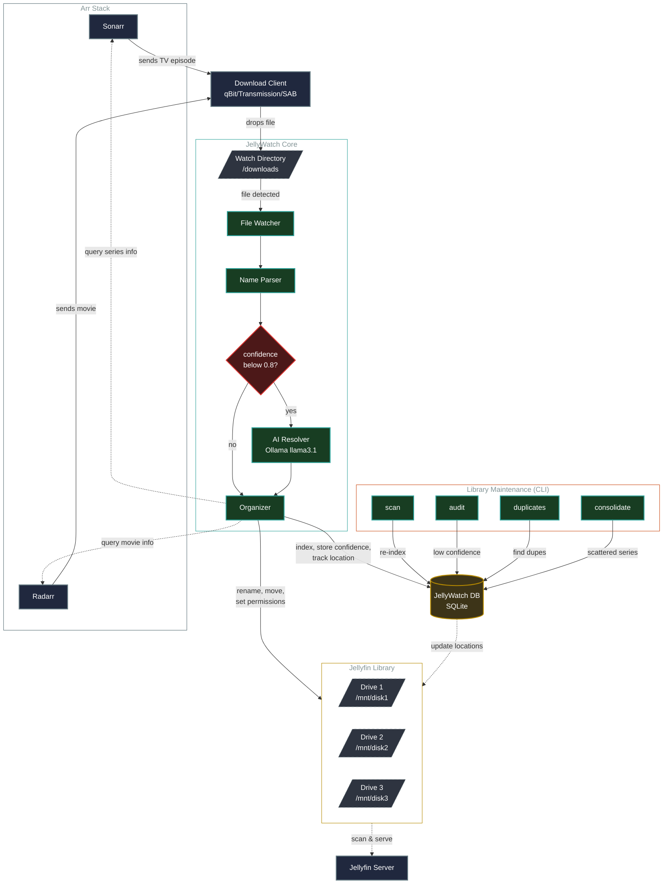

# JellyWatch Architecture

## Flow Description

### Real-time Ingestion (Top to Bottom)
1. **Arr Stack**: Sonarr/Radarr send content to download clients
2. **Ingestion**: Download client drops file to watch directory
3. **JellyWatch Core**: 
   - File watcher detects new file
   - Name parser extracts title/year/episode info via regex
   - Confidence check: if < 0.8, queries local Ollama AI
   - Organizer queries Sonarr/Radarr for metadata verification
   - Renames file to Jellyfin standards, moves to appropriate drive
   - Indexes in SQLite database

### Library Maintenance (CLI Commands)
Run periodically on existing library:
- **scan**: Re-index all files across drives
- **audit**: Find low-confidence parses, suggest AI fixes
- **duplicates**: Find same content on multiple drives, keep best quality
- **consolidate**: Find scattered series (S01 on disk1, S02 on disk2), suggest merging

### Multi-Drive Topology
Library spans multiple drives. Database tracks location of every file. Maintenance operations read from DB, operate on filesystem, update DB with new locations.
